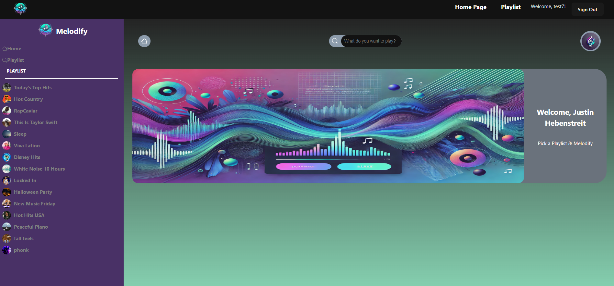

# Melodify

This template provides a minimal setup to get React working in Vite with HMR and some ESLint rules.
Melodify is a music playlist management application that allows users to create, manage, and play their favorite playlists.

Currently, two official plugins are available:
## Table of Contents

- [@vitejs/plugin-react](https://github.com/vitejs/vite-plugin-react/blob/main/packages/plugin-react/README.md) uses [Babel](https://babeljs.io/) for Fast Refresh
- [@vitejs/plugin-react-swc](https://github.com/vitejs/vite-plugin-react-swc) uses [SWC](https://swc.rs/) for Fast Refresh
=======
Melodify is a music playlist management application that allows users to create, manage, and play their favorite playlists.

## Table of Contents

- [Features](#features)
- [Installation](#installation)
- [Usage](#usage)
- [Contributing](#contributing)
- [License](#license)


## Expanding the ESLint configuration
## Features

If you are developing a production application, we recommend updating the configuration to enable type aware lint rules:
=======
## Features

- Create and manage playlists
- Add and remove songs from playlists
- Play songs directly from the application
- User authentication and profile management

- Configure the top-level `parserOptions` property like this:



=======

## Installation

To get started with Melodify, follow these steps:

1. Clone the repository:
    ```bash
    git clone https://github.com/yourusername/melodify.git
    ```

2. Navigate to the project directory:
    ```bash
    cd melodify
    ```

3. Install the dependencies:
    ```bash
    npm install
    ```

4. Start the development server:
    ```bash
    npm start
    ```

## Usage

Once the development server is running, you can access the application in your web browser at `http://localhost:3000`.

### Sidebar Component

The Sidebar component is used to display the list of playlists. It accepts the following props:

- `onSelectPlaylist`: A function that is called when a playlist is selected. The function receives the playlist ID as an argument.

Example usage:

```js
export default tseslint.config({
@@ -25,26 +65,3 @@ export default tseslint.config({
})
```

